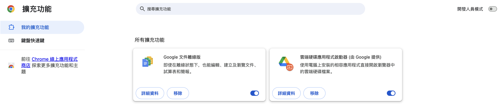

# CCU course searcher

> 應用名稱：CCU course searcher（中正課程查詢系統）
> 應用頁面：https://kiki.ccu.edu.tw/~ccmisp06/Course/
> 瀏覽器：**Chrome**

## 使用方法

## 安裝方法

> PS：由於 Google 的功能還位於審核階段，所以還在未在Chrome應用程式中上架。

**開啟開發人員模式**：

1. 使用瀏覽器Chrome，並進入擴充功能頁面 [chrome://extensions/](chrome://extensions/)

    

2. 點擊開啟右上方開發人員模式，（ $\large\rightarrow$ ），此時頁面會出現

    

